## Portfolio

---

This site is a "work in progress"...

<!-- wstawic zdjece appki -->
While you are here please go and check out my concept for the [minimal pairs language training app](https://github.com/gorczakowski/minimal-pairs-app){:target="_blank"}

---

### My Master Thesis - Revisited With Python

    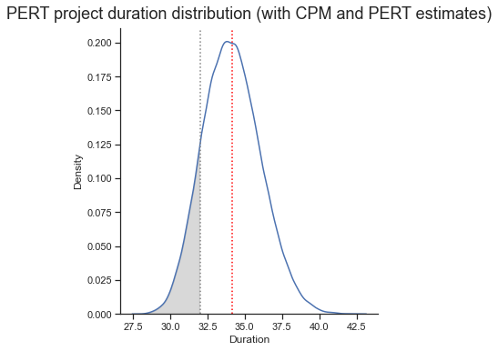

Jupyter Notebook about modeling project schedules and estimating time risk using the Monte Carlo simulation. In this notebook, I revisit the practical example from my civil engineering master thesis.

[Link to the notebook](https://github.com/gorczakowski/python-various/blob/master/master_thesis_revisited/my_master_thesis.ipynb){:target="_blank"}  

---

### My Work at Tesla ⚡

I can't say much (NDA), but I helped develop internal BIM workflows and data extraction scheme for further use in our in-house ERP system.
I also designed multiple Tesla locations across Central EMEA region.

---

### Office Building 'Nowy Rynek' in Poznań

    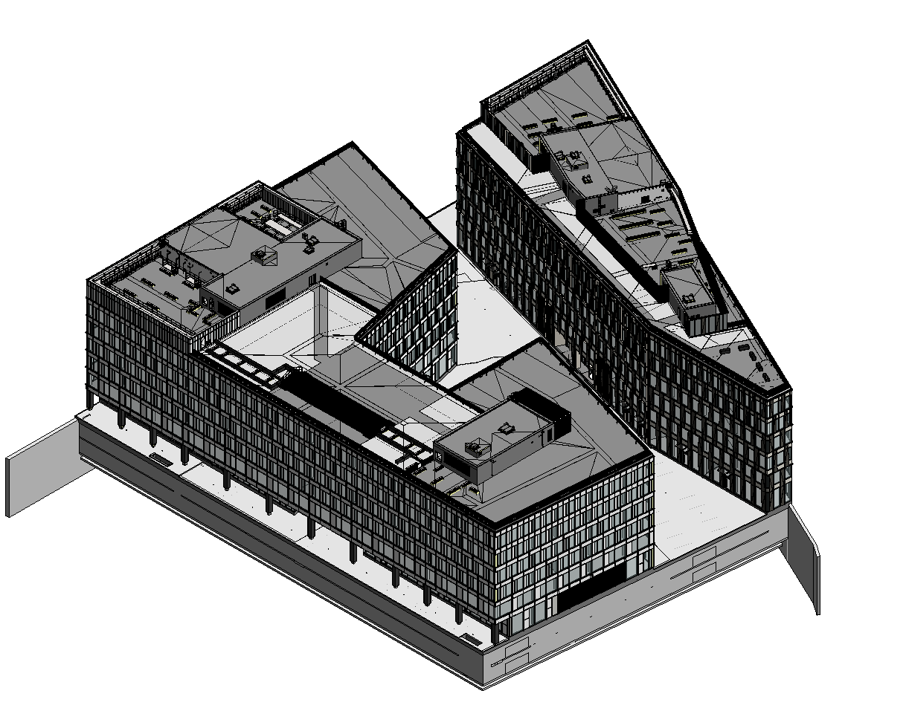
    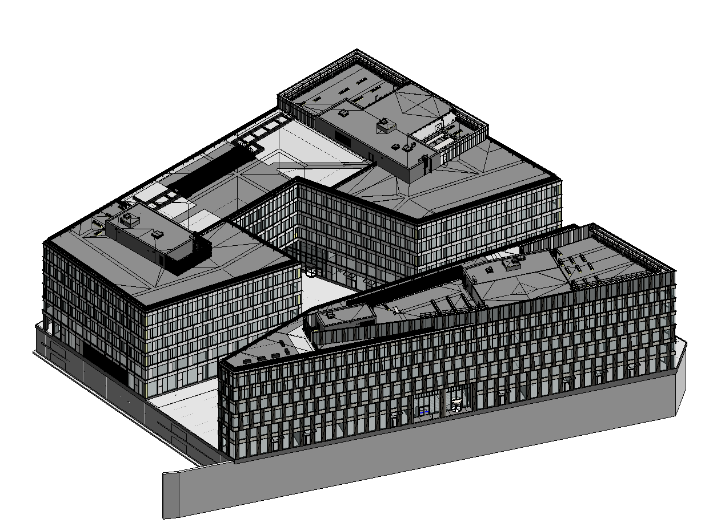
    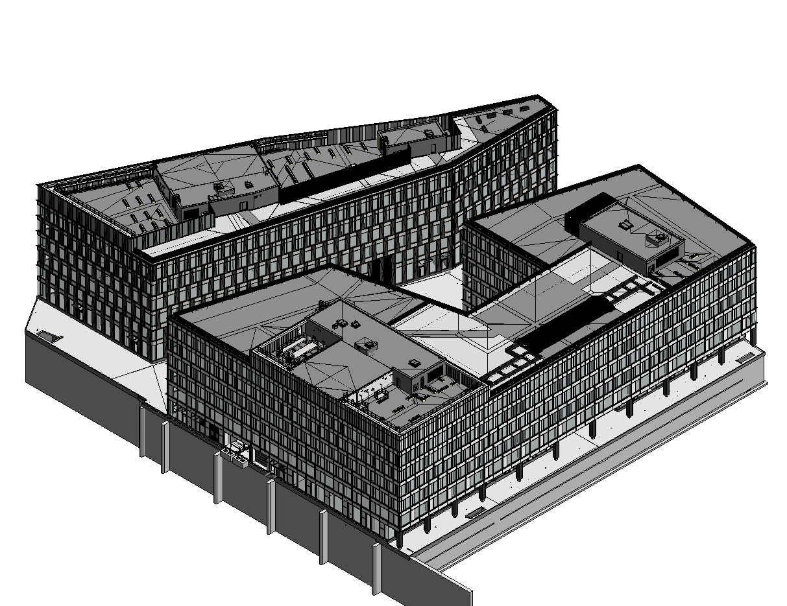
    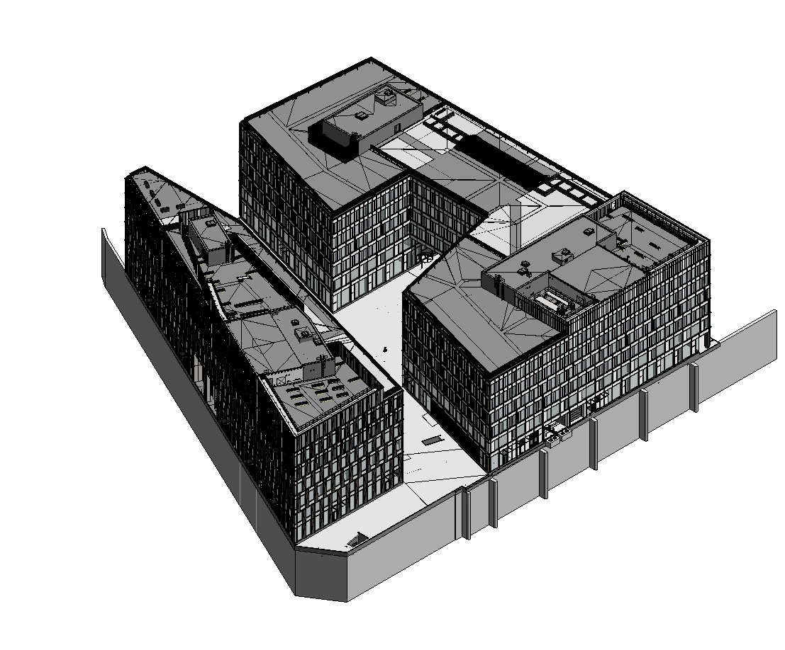

*Images courtesy of Maćków Pracownia Projektowa.*  

I worked on this project as a Revit specialist and BIM coordinator 👌

[Project on MPP website](http://www.mackow.pl/projects/nowy-rynek-a-i-b/){:target="_blank"}  
[Project on Skanska website](https://www.skanska.pl/en-us/offer/offices/our-offer/poznan/nowy-rynek/){:target="_blank"}  

---

### Custom Nodes

    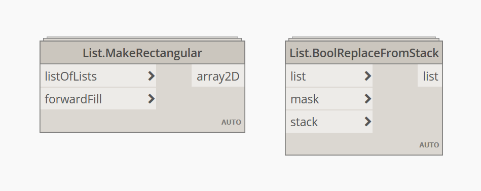

I create custom nodes and python snippets which expand the functionality of my Dynamo scripts.  
<!-- The general-use nodes (like the two pictured above), can be found in the repository below.   -->

<!-- [Link to nodes repository](https://github.com/gorczakowski/dynamo-custom-nodes){:target="_blank"}   -->

---

### Bridge Design in Dynamo - Altglienicker Brücke (Berlin)

    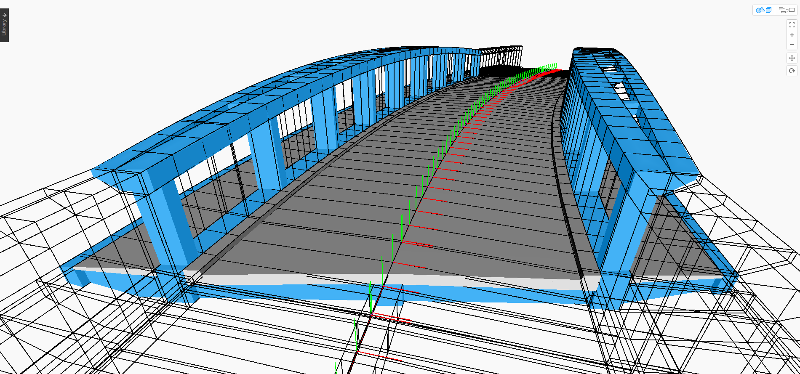
    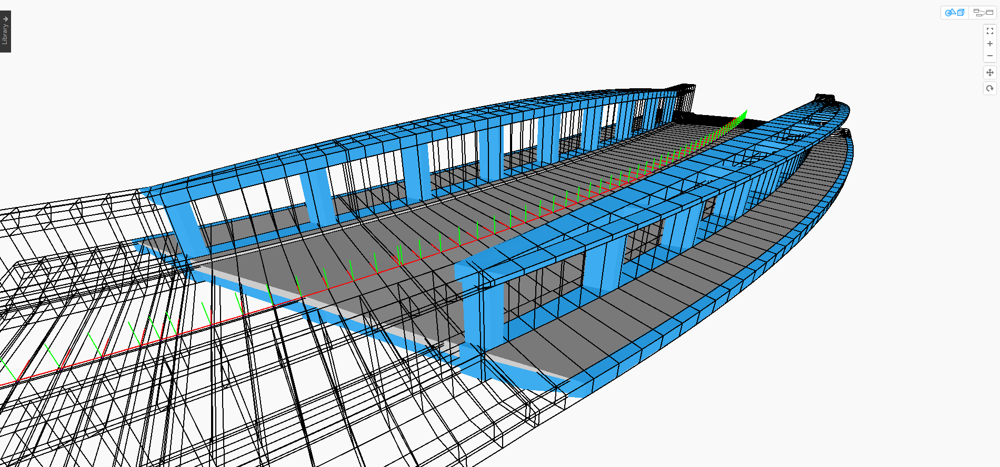
    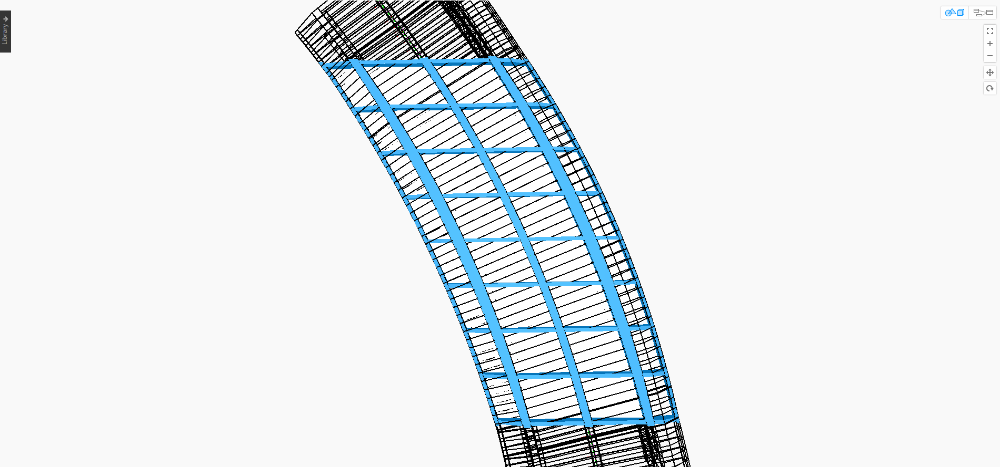
    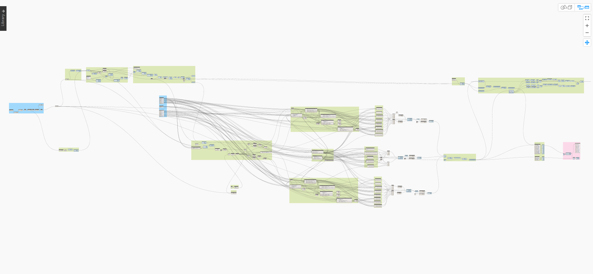

While working at AFRY Deutschland I modeled a variable cross-section bridge design entirely in dynamo. Street alignment is brought from Civil 3D using the CivilConnection package.

---

### Deutsche Bahn Projects 🚆

Learn about the other projects for Deutsche Bahn I worked on at AFRY Deutschland: 
1. [Bahnhof Gößnitz](https://bauprojekte.deutschebahn.com/p/weimar-goessnitz){:target="_blank"}
2. [Bahnprojekt Hamburg/Bremen – Hannover (HHBH)](https://www.hamburg-bremen-hannover.de/){:target="_blank"}
3. [Daglfinger und Truderinger Kurve (DTK)](https://www.bahnausbau-muenchen.de/projekt.html?PID=23){:target="_blank"}

---

### Train Platform Renovation

    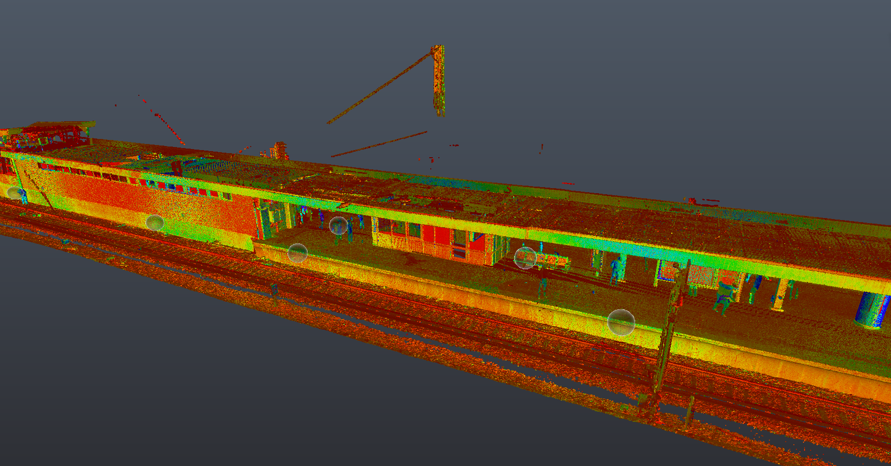
    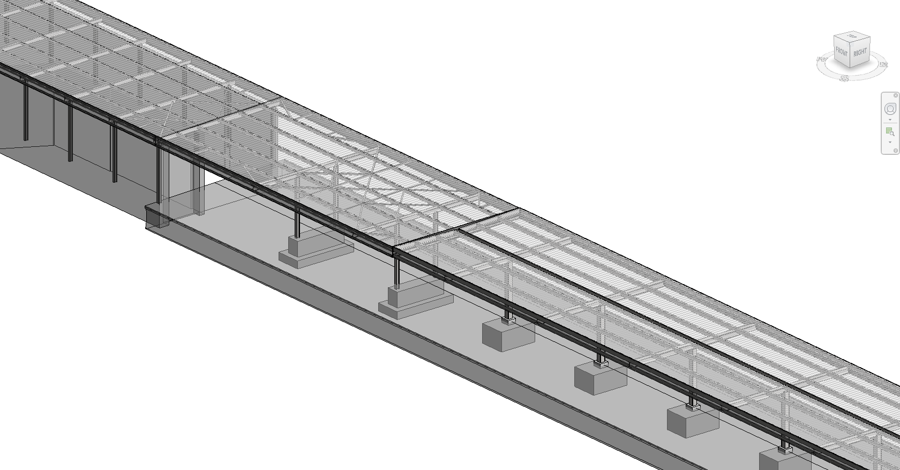
    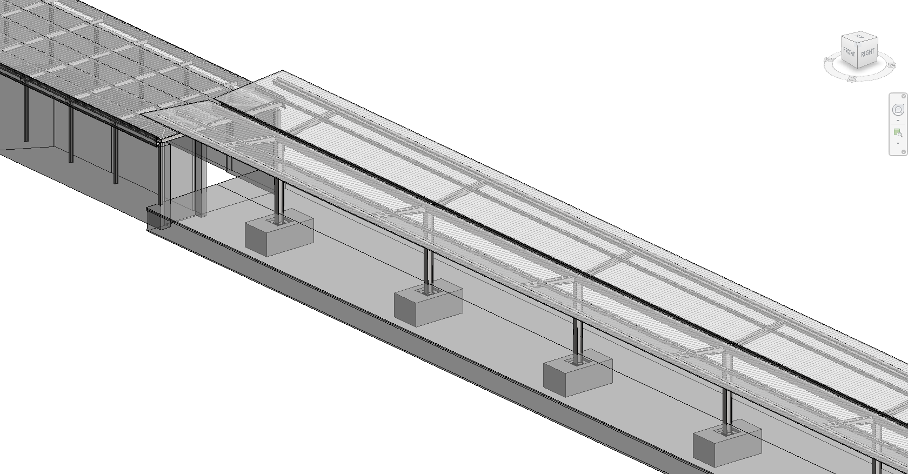
    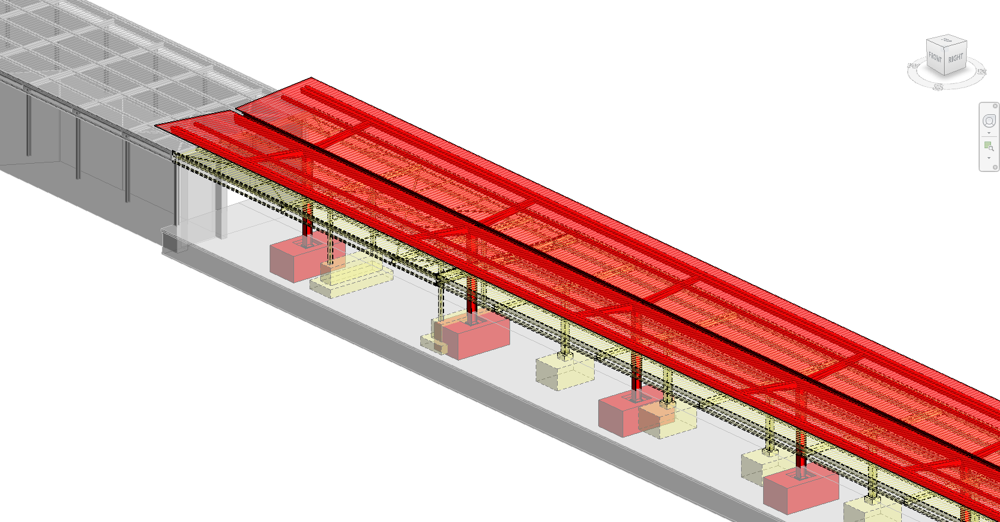

Light-rail train platform in Hamburg - in this project the existing structure is modeled based on point-cloud data. The roof is divided into two parts: one that remains (grey) and other for demolition (yellow). New construction can be seen in (red).
 